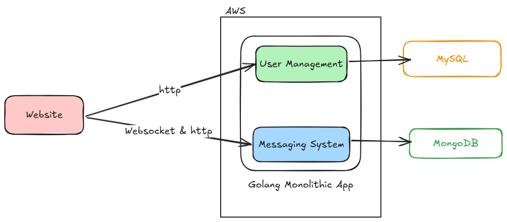

# Go Simple Messaging App

Diagrams :

## Library & Framework
- [Go Fiber](https://gofiber.io/)
- [GORM](https://gorm.io/)
- [Go Elastic APM](https://pkg.go.dev/go.elastic.co/apm/v2)
- [Golang JWT](https://github.com/golang-jwt/jwt/v5)
- [Gofiber Websocket](https://github.com/gofiber/contrib/websocket)
- [GodotEnv](https://github.com/joho/godotenv)

## Tech Stack
- Go
- MongoDB
- MySQL
- WebSocket
- ELK (ElasticSearch, Logstash, Kibana) Stack for Observability
